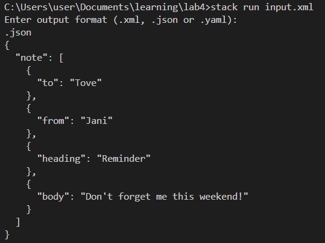
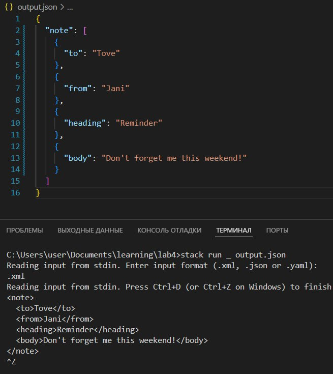
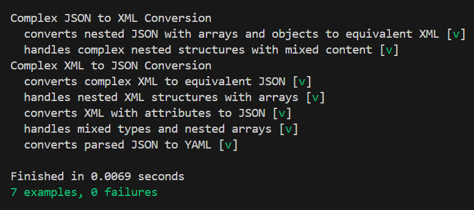

Лабораторная работа №4. Парсер форматов
======

Хасаншин Марат Айратович P3333

Анисимов Максим Дмитриевич Р3333

Цель лабораторной работы
---

Разработать программу, которая позволяет
конвертировать файлы форматов
XML, JSON, YAML

Основная реализация
---

Есть 4 способа работы с программой:

1. Программа принимает два
аргумента командной строки -
входной и выходной файл,
конвертирует
содержимое первого файла,
и сохраняет результат во
второй:

    

2. Пользователь вводит только один аргумент
программы - входной файл. В таком случае программа
выведет ответ в стандартный поток вывода:

    

3. Пользователь запускает программу и
вводит данные через стандартный ввод.
Вывод программы идёт в стандартный
вывод

    

4. Пользователь вводит текст через стандартный
ввод и программа записывает результат
в стандартный вывод

    

Команда для работы с программой
---

Работа с двумя файлами:

    stack exec lab4-exe <входной файл> <выходной файл>

Работа с одним входным файлом и стандартным
выводом:

    stack exec lab4-exe <входной файл>

Работа со стандартным вводом-выводом:

    stack exec lab4-exe

Работа со стандартным вводом и записью результата в файл:

    stack exec lab4-exe _ <выходной файл>

Структура программы
---

    haskell-parser:
    - app
         Main.hs
    - src
        - Parser
             JSON.hs
             XML.hs
             YAML.hs
         Converter.hs
         Types.hs
    - test
        Spec.hs

Результат выполнения тестов
---

